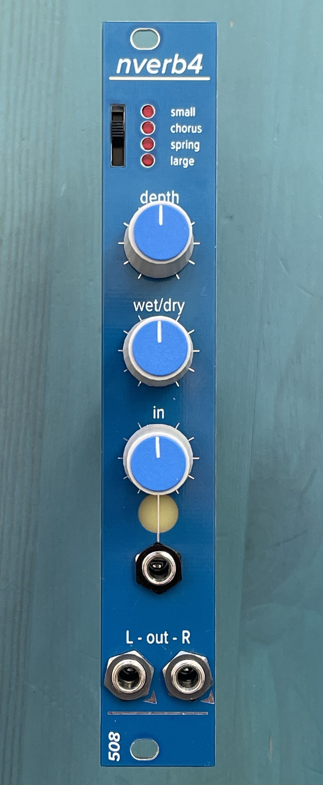

# nverb4

Reverb/Delay module based on the Nemesis NemFX reverb-on-a-chip

Main features:
* 4 programs
  * 1 chorus/reverb
  * 1 spring reverb
  * 2 room/hall reverbs
* Mono in / Stereo out

4HP, 147mm deep, 110mA +12V, 41mA -12V

Note: The NemFX chip is not recommended for new designs, i.e. it's discontinued. The distributor seems to have dropped them :(

This module, like many of my modules, uses 2mm-pitch male/female headers. Be sure you order/use the right thing!
